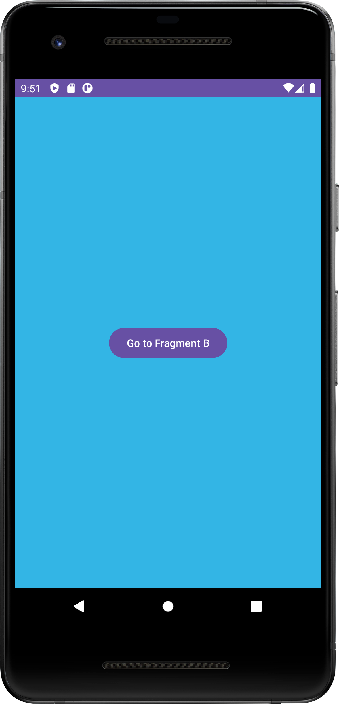
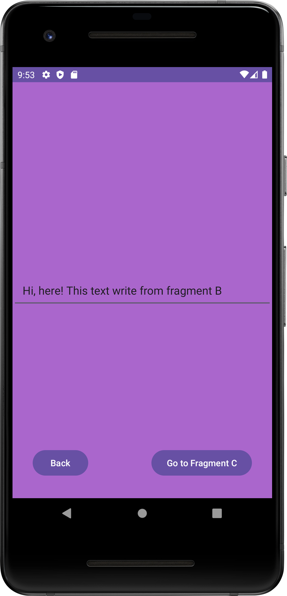
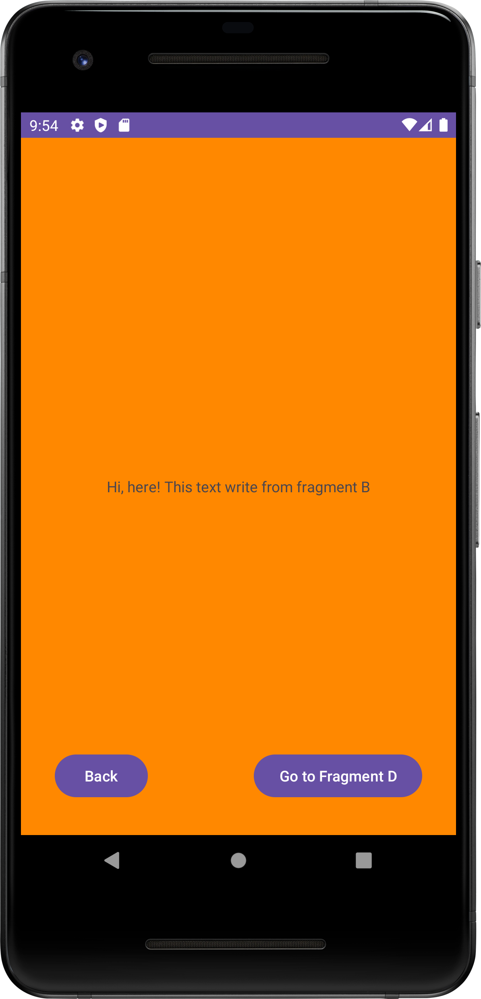
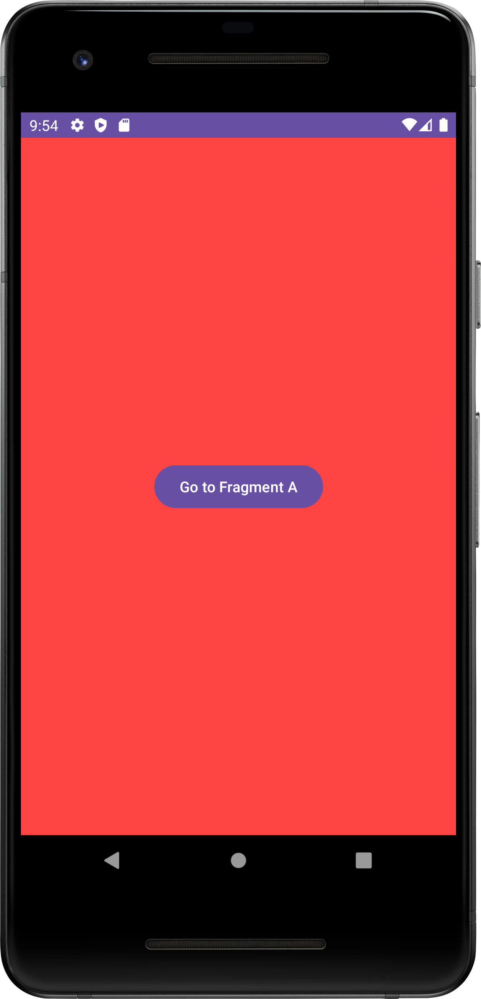

# simple_fragments
This repository for training fragment

This application has 4 fragments:
 - Fragment A transitions to Fragment B.
 - Fragment B transitions to Fragment C, passing along some text. Fragment B can also return to Fragment A.
 - Fragment C displays the text from Fragment B. It can also go back or transition to Fragment D.
 - Fragment D transitions to Fragment A (the chain of fragments in the backstack is deleted).

## Built With
1. Kotlin
2. XML
3. Fragment manager

## Gif

## Screenshots
 
 
